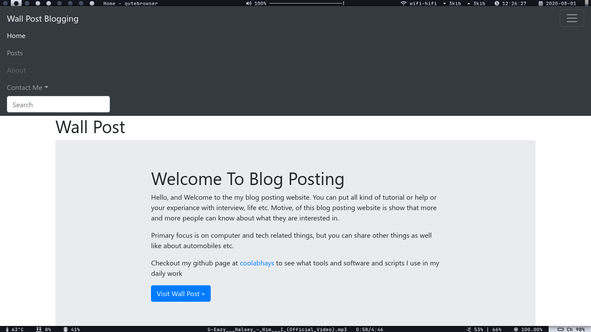
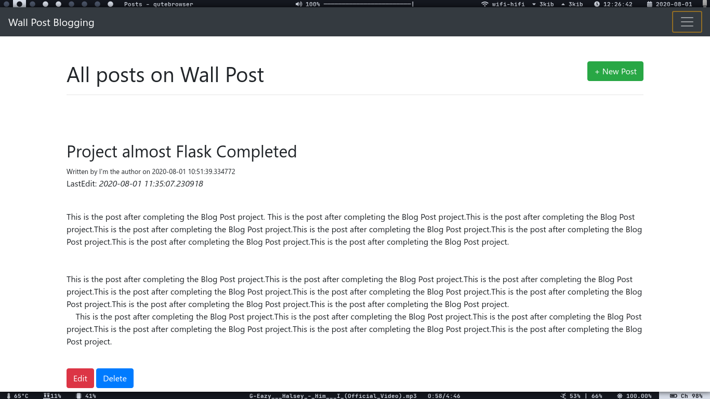
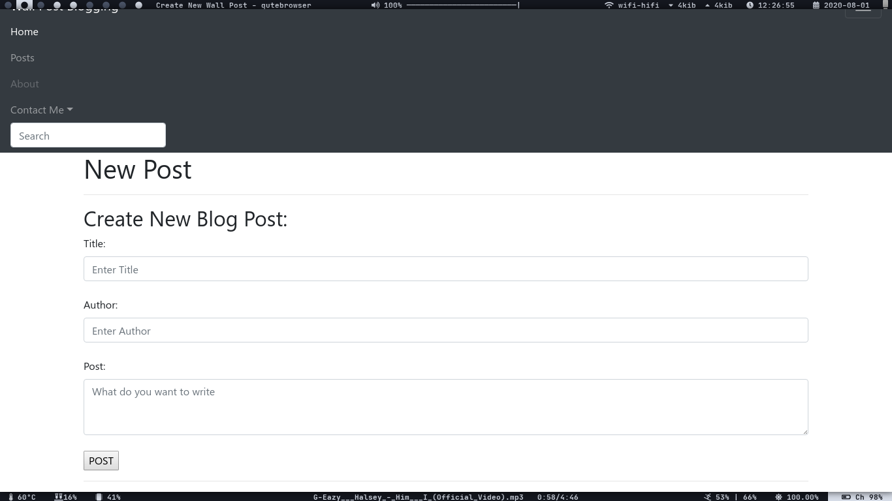
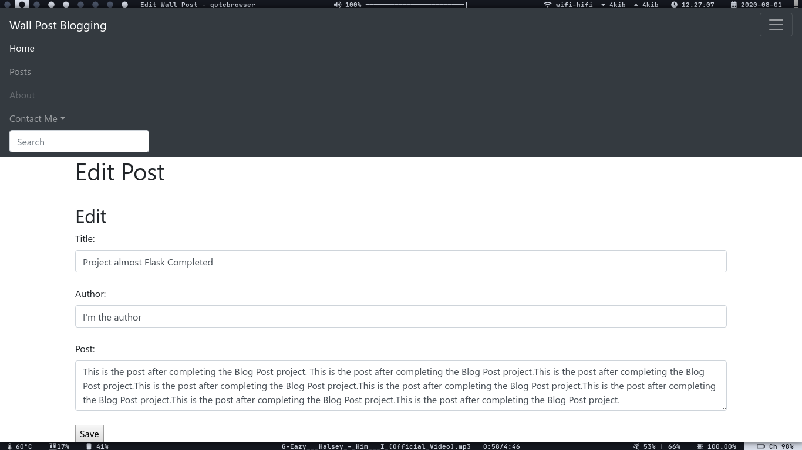

# Wall Post Blog


**A basic blogging webpage built upon the "Flask" framework.**

It fulfills the **CRUD(Create, Read, Update, Delete)** functionality.

To see it working, you can install the modules given in `requirements.txt` file

If you want setup a virtual environment,

```sh
$ sudo pacman -S virtualenv
$ virtualenv -p python3 .
```

Then, install the modules

```sh
$ python3 -m pip install -r requirements.txt
or
$ pip3 install -r requirements.txt
```

If you are using inside virtualenv, use

```sh
$ pip3 install --user -r requirements.txt
```

or install with same command with `sudo !!`


Here, are some screenshots of it:

* **Index Page:**



* **Posting Page**:



* **New Post Page:**



* **Edit Post Page:**


